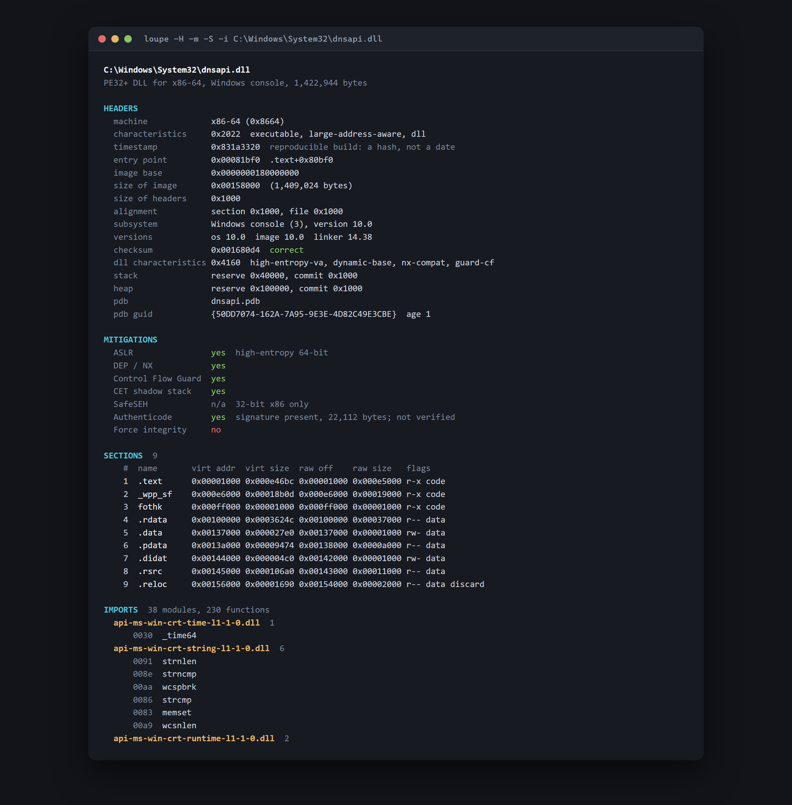
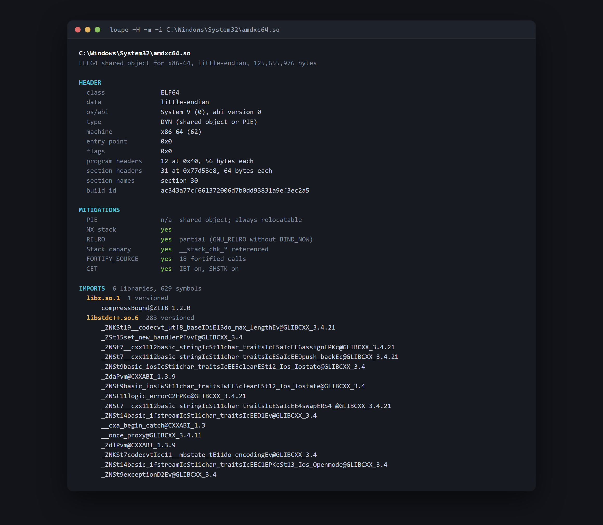

# Loupe

[](https://github.com/ElatDev/loupe/actions/workflows/ci.yml)
[](LICENSE)


A small, readable executable inspector in C. It prints what a binary is made
of — headers, sections, imports, exports, symbols, security mitigations — for
Windows PE and Unix ELF files, on either platform.

**Loupe only reads.** It never modifies, patches, injects, unpacks or executes
anything. It opens a file read-only, copies the bytes into memory and prints
what it finds. That is the whole program.



```
$ loupe C:\Windows\System32\dnsapi.dll     # headers, mitigations, sections, imports, exports
$ loupe -a /usr/lib/libssl.so.3            # everything, including symbols and the dynamic section
$ loupe --flat -i app.exe | sort           # one tab-separated record per line
```

## Why

`dumpbin` is Windows-only and ships with Visual Studio; `readelf` is
Unix-only. I wanted one tool that reads both formats, builds anywhere from a
single compile command with no dependencies, and is small enough to read in an
afternoon.

The second reason is the parsing itself. Every offset, size and count in an
executable was written by someone else and may be a lie. Getting that right —
so that no file, however deliberately broken, can make the parser read out of
bounds, loop forever or leak — is the part of the job worth showing.

## What it prints

**PE (PE32 and PE32+)**

- COFF and optional headers: machine, subsystem, entry point, image base,
  alignment, linker version, stack and heap sizes
- The checksum, recomputed from the file and compared with the stored one
- CodeView debug record: PDB path, GUID and age; reproducible-build detection
- Section table with permissions decoded, including long names from the COFF
  string table
- Data directories, and which section each one lands in
- Imports, by name and by ordinal, including delay-load imports
- Exports by ordinal, hint and RVA, including forwarders (`NTDLL.RtlFoo`) and
  ordinal-only (`[NONAME]`) entries
- TLS callbacks, .NET header, Authenticode presence (not verified)
- Mitigations: ASLR and high-entropy VA, DEP, Control Flow Guard, CET shadow
  stack, SafeSEH, Force Integrity

**ELF (ELF32 and ELF64, little- and big-endian)**

- ELF header, including extended section numbering (`SHN_XINDEX`)
- Program headers, section headers, the dynamic section, notes and the GNU
  build id
- Symbol tables with GNU symbol versions (`puts@GLIBC_2.2.5`,
  `foo@@LIBFOO_1.0`)
- Imports grouped by the library each versioned symbol is resolved from, which
  is the closest ELF gets to the PE view of "what does this binary need"
- Exports: defined, externally visible dynamic symbols
- Mitigations: PIE, NX stack, RELRO (partial or full), stack canary,
  FORTIFY_SOURCE, CET/IBT and BTI/PAC



## Building

No dependencies beyond the C standard library. One command:

```sh
cc -std=c11 -O2 -Wall -Wextra -Werror -Isrc -o loupe src/*.c
```

or use the build scripts, which also cover the sanitizer, test and fuzzing
builds:

```sh
make                 # release            -> build/loupe
make test            # unit tests under ASan, UBSan and LeakSanitizer
```

```bat
build.bat            :: release           -> build\loupe.exe
build.bat test       :: unit tests under AddressSanitizer
```

The MSVC build is `/W4 /WX` clean, the gcc and clang builds are
`-Wall -Wextra -Wpedantic -Wshadow -Werror` clean, and CI builds all three on
every push. The Windows build embeds a manifest that sets the process code
page to UTF-8, so paths with non-ASCII characters open instead of failing.

## Claims you can check

Every number below comes from a command in this repository that anyone can
re-run.

**It parses every binary in `C:\Windows\System32` — 4,264 of them — with no
crashes, no memory errors and no leaks**, and every one in `SysWOW64` (2,788
more, 32-bit) on top of that.

```powershell
.\build.bat asan
.\scripts\sweep.ps1
```

```
files          4,568        # everything in the directory, not just executables
  PE           4,263
  ELF          1            # amdxc64.so, an AMD shader compiler, hiding in System32
clean          4,264        # parsed with nothing to report
warnings       0 files
malformed      0
not PE/ELF     304
bytes parsed   2.68 GiB
time           12.16 s        # 376 files a second, sanitized
heap           0 live blocks at exit, 21,124 allocations total, no leaks
```

That is the AddressSanitizer build, which is the point: 2.68 GiB of
attacker-shaped input read through the bounds checker with nothing to report.
The six files in `SysWOW64` that are not clean are not failures either — they
are 16-bit NE DLLs left over from Windows 3.1, and Loupe says so by name
rather than guessing at them.

The same sweep over an Android NDK (1,681 ELF files for ARM, ARM64, x86, x86-64
and RISC-V, plus 92 PE files) is also clean. On Linux the equivalent is:

```sh
make asan
find /usr/bin /usr/lib -type f | ./build/asan/loupe --batch
```

**Its imports and exports match `dumpbin` on all 7,048 PE files in System32
and SysWOW64 — 1,654,321 records, zero differences.**

```powershell
python scripts\diff_dumpbin.py --dir C:\Windows\System32
python scripts\diff_dumpbin.py --dir C:\Windows\SysWOW64
```

```
4260 files agree (969165 import/export records), 0 mismatched, 308 skipped
2788 files agree (685156 import/export records), 0 mismatched,  81 skipped
```

SysWOW64 matters because it is where the 32-bit code path lives: different
thunk width, different ordinal flag, a different optional header, and SafeSEH
instead of CET. The skipped files are the ones that are not PE at all, plus a
couple that a running process had locked.

**Its section headers, program headers, needed libraries and dynamic symbols
match `llvm-readelf` on all 1,681 ELF files in the NDK — 313,203 records, zero
differences.**

```powershell
python scripts\diff_readelf.py --dir C:\dev\Android\Sdk\ndk --recurse
```

```
1681 files agree (313203 records), 0 mismatched, 5992 skipped
```

Two independently written parsers agreeing on a million records is a stronger
statement about correctness than any hand-checked example.

**Fuzzing: 50,000 mutated executables and 200,000 coverage-guided executions
under AddressSanitizer. No crashes, no out-of-bounds reads, no leaks, no
hangs.**

```bat
build.bat mutate
build\fuzz\mutate.exe --runs 50000 build\loupe.exe C:\Windows\System32\kernel32.dll ...

build.bat fuzz
build\fuzz\fuzz_loupe.exe corpus -max_len=65536 -timeout=10 -runs=200000
```

```
50000 runs in 150.5 s (332/s)
  parsed clean         18469
  parsed with warnings 27698 (498839 warnings)
  rejected             3288 unsupported, 545 malformed
  slowest run          0.345 s
  heap                 0 live blocks, 153639 allocations total
```

The mutation runs are reproducible: the same `--seed` and the same seed files
replay the same sequence, so a failure can be run again under a debugger.

libFuzzer grew a 23-file seed corpus to 1,013 inputs over 200,000 executions
in 11 minutes, with no crashes, no leaks and no timeouts.

The fuzzing did find something, which is the point of doing it. Neither
campaign found a memory error, but both found slow inputs: a mutated 125 MB
shared object that took **21 seconds**, and a 1 MB input libFuzzer saved
because it took **ten**. Both had the same cause — a file that contradicts
itself a million times, with the time going into formatting warning messages
nobody would ever read.

Warnings past the display cap are now counted without being formatted, a file
that produces 5,000 of them is abandoned as having nothing left to say, and
the work budget was tightened from 67 million iterations to 8.4 million, which
is still four times what the most demanding real binary in the sweeps needs.
The input libFuzzer saved now parses in 0.34 seconds, and the worst case in a
50,000-run campaign is 0.35 seconds under AddressSanitizer.

**The unit tests parse 14,374 truncated images and 44,371 single-byte
mutations of the fixtures**, on top of the specific hostile cases, and check
that the allocation count returns to zero after every single parse.

```
237 checks, 0 failures, 0 allocations still live
```

## Treating every file as hostile

The bounds-checking layer was written before any parsing code, and everything
else is built on top of it.

**One accessor.** `lp_slice_at(image, offset, length)` is the only function in
the program that turns a file offset into bytes. It validates the range
against the number of bytes actually read from disk — never against anything
the file claims about itself — with arithmetic that cannot wrap, and returns
either a slice or an error.

**The compiler enforces it.** `lp_image` is an opaque type. Outside
`image.c`, nothing can see the buffer pointer, so no parser can index the file
directly even by accident. Values come out through readers that check every
read against the slice's own length.

**Failure is sticky and harmless.** A slice that failed to open, or that a
reader overran, is poisoned: further reads return zero and touch nothing. A
caller that ignores an error still cannot read out of bounds.

**No string is assumed to be terminated.** Names are copied into a bounded
buffer, with the scan limited to the end of the string table, section or
region they live in — whichever comes first — and are flagged as unterminated
or truncated rather than trusted.

**Every count is clamped twice**: against a fixed limit, and against what the
file could physically hold. A section table claiming 65,535 sections in a
4 KiB file is cut to the number that fit, with a warning naming both numbers.

**Every loop is bounded, and their product too.** Each loop has its own cap,
and the whole file shares a work budget of 8.4 million iterations, charged for
nested work such as an RVA lookup across thousands of sections, a version
lookup per symbol, or the bytes scanned to read a name. A file that exhausts
it gets a warning saying the output is incomplete, rather than minutes of CPU
time. The size of the budget was
measured rather than guessed: cut it to a quarter and all 8,825 real binaries
in the sweeps above still parse completely; cut it to an eighth and one of
them runs out.

**Output is escaped.** Bytes outside printable ASCII become `\xNN`, so a
binary cannot inject terminal escape sequences into the output of a tool
someone runs on it.

**Anomalies are reported, not hidden.** Anything that contradicts itself is
printed as a warning next to the data it affects, counted, and reflected in
the exit status — so the sweeps above are meaningful: 4,264 files with nothing
to report means the parser found nothing to report, not that it kept quiet.

That last point has teeth. Handed an ELF file whose `PT_INTERP` segment has
`p_filesz` of zero, `llvm-readelf` prints the interpreter as `ELF` — it reads
the string from the segment's offset without honouring its length, and finds
the file's own magic number. Loupe reports the segment as empty.

## Where it stops

- **Read-only.** No patching, no injection, no writing, no unpacking, no
  decryption, ever.
- No disassembly. Printing structure is this project; decoding instructions is
  a much larger one.
- No resource extraction, no relocation dumps, no COFF object files.
- No GUI, no dependencies.

## Usage

```
loupe [options] FILE...
loupe --batch [-v] < list-of-paths

What to show (default -HmSlie):
  -H, --headers       file header
  -m, --mitigations   ASLR, DEP, CFG, CET (PE); PIE, NX, RELRO, canary (ELF)
  -S, --sections      section table
  -l, --segments      program headers (ELF)
  -d, --directories   data directories (PE)
  -i, --imports       imported modules and functions
  -e, --exports       exported functions and symbols
  -D, --dynamic       dynamic section (ELF)
  -s, --symbols       symbol tables (ELF)
  -g, --debug         debug directory and TLS callbacks (PE), notes (ELF)
  -a, --all           everything above

Output:
      --flat          one tab-separated record per line, for grep and diff
      --color=WHEN    auto (default), always or never
  -q, --quiet         print nothing; report through the exit status

Batch:
      --batch         read paths from stdin, parse each one fully and silently,
                      list the files that are not clean, then print a summary
```

Exit status: `0` clean, `1` parsed with warnings, `2` not PE/ELF or malformed,
`3` unreadable, `64` usage error — so `loupe -q` is usable as a check in a
script. `--batch` is how the sweeps above run: one process, every file parsed
with everything enabled, output discarded, and the live allocation count
checked after each file; its counts are in the summary and its exit status is
`0` unless a leak was found.

## Source layout

| File | What it does |
| --- | --- |
| `src/image.c` | The bounds-checked layer: the one accessor, readers, strings, file loading |
| `src/pe.c` | PE32/PE32+ parsing and printing, including RVA-to-offset translation |
| `src/elf.c` | ELF32/ELF64 parsing and printing, both byte orders, symbol versions |
| `src/inspect.c` | Format detection, warnings, the work budget |
| `src/out.c` | Output sinks (file, memory, discard), colour, escaping |
| `src/mem.c` | Counted allocation, so leaks show up as a number |
| `src/term.c` | The only platform-specific code: does stdout want colour |
| `src/main.c` | Command line and batch mode |
| `tests/` | Unit tests: in-memory fixtures, hostile cases, brute-force sweeps |
| `fuzz/` | libFuzzer target and the standalone mutation fuzzer |
| `scripts/` | Sweeps, the differential tests, the README screenshot |

About 4,800 lines of C11 in `src/`, plus 1,300 more of tests and fuzzing
harnesses. No dependencies.

## License

MIT — see [LICENSE](LICENSE).
